<p align="center">
  
  
  
  
  
  
</p>

<h1 align="center">Queue Up</h1>

<p align="center">
  <strong>A music-based social platform that connects people through shared Spotify taste</strong>
</p>

<p align="center">
  <a href="https://queue-up.onrender.com"></a>
</p>

<p align="center">
  <a href="#features">Features</a> •
  <a href="#architecture">Architecture</a> •
  <a href="#getting-started">Getting Started</a> •
  <a href="#api-reference">API Reference</a>
</p>

---

## What is Queue Up?

Queue Up is a social platform that connects people through their music taste. The idea is simple: if two people listen to the same artists, save the same tracks, and follow the same musicians on Spotify, they probably have something in common worth exploring.

When you sign up, the application pulls your listening data from Spotify, including your top artists and tracks, your saved library, and the artists you follow. It then compares this data against other users and calculates a compatibility score. Users with higher scores appear first in your feed, and you can swipe through profiles to decide who you want to connect with. When two users both swipe right on each other, they match and can start chatting.

The chat system runs on WebSockets, so messages appear instantly without needing to refresh the page. You can also see who is currently online, and the app will notify you in real time when you get a new match or message.

The entire application is built as a single deployable artifact. The React frontend compiles into static files that get bundled directly into the Spring Boot JAR, so there is only one thing to deploy. This simplifies hosting significantly since you do not need separate servers for the frontend and backend.

---

## Demo Video

Check out the live application at **[queue-up.onrender.com](https://queue-up.onrender.com)**

<!-- Add your demo video here -->


https://github.com/user-attachments/assets/ca5e5ba3-b323-47e9-ba25-12381c34ab03


---

## Screenshots

### Login Screen


### Home/Swipe View


### Chat Interface


### Profile Page


---

## Features

### How the Matching Works

The core of Queue Up is its music comparison engine. When you create an account and link your Spotify, the application fetches four categories of data: your top 50 artists, your top 50 tracks, your 50 most recently saved tracks, and the artists you follow. This data gets stored in the database and associated with your profile.

When you open the app to browse profiles, the backend fetches all users you have not interacted with yet and runs a comparison algorithm against each one. For every artist or track you have in common with another user, you earn points. Top artists are weighted at 3 points each because having the same favorite artists is a strong indicator of compatibility. Top tracks are worth 2 points, and saved tracks and followed artists are worth 1 point each. The profiles are then sorted by this score, so the people you are most musically compatible with appear first.

### Real-time Messaging

Once two users match, they can message each other through the built-in chat. The messaging system uses WebSocket connections rather than HTTP polling, which means messages appear on both ends immediately after being sent. The app also tracks typing indicators, so you can see when the other person is composing a message.

All messages are persisted in the database, so your conversation history is preserved across sessions. The chat also supports file attachments through AWS S3 and automatically generates link previews when you share URLs.

### Authentication and Security

User authentication is handled through JSON Web Tokens stored in HTTP-only cookies. When you log in, the server generates a token containing your user ID, signs it with a secret key, and sets it as a cookie on the response. All subsequent requests include this cookie automatically, and a middleware filter validates the token before allowing access to protected endpoints.

Passwords are never stored in plain text. They are hashed using BCrypt with a cost factor of 12 before being written to the database. Even if someone gained access to the database, they would not be able to reverse the hashes to obtain the original passwords.

### File Storage

Profile pictures are uploaded to Cloudinary during signup or when updating your profile. The frontend converts the image to a base64 string, sends it to the backend, and the backend uploads it to Cloudinary and stores the returned URL in the database.

For chat attachments, the app uses AWS S3 with presigned URLs. When you want to upload a file, the frontend first requests a presigned URL from the backend. This URL grants temporary permission to upload directly to S3, so the file never passes through the backend server. This keeps the server lightweight and offloads bandwidth to AWS.

---

## Architecture

### High-Level System Architecture

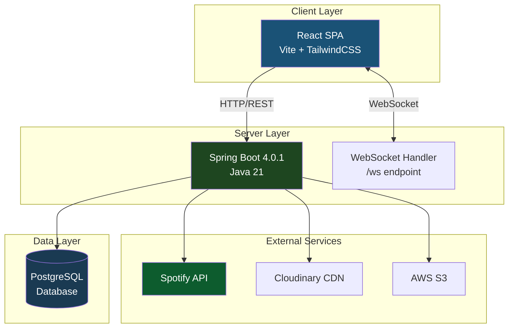

### Request Flow Architecture

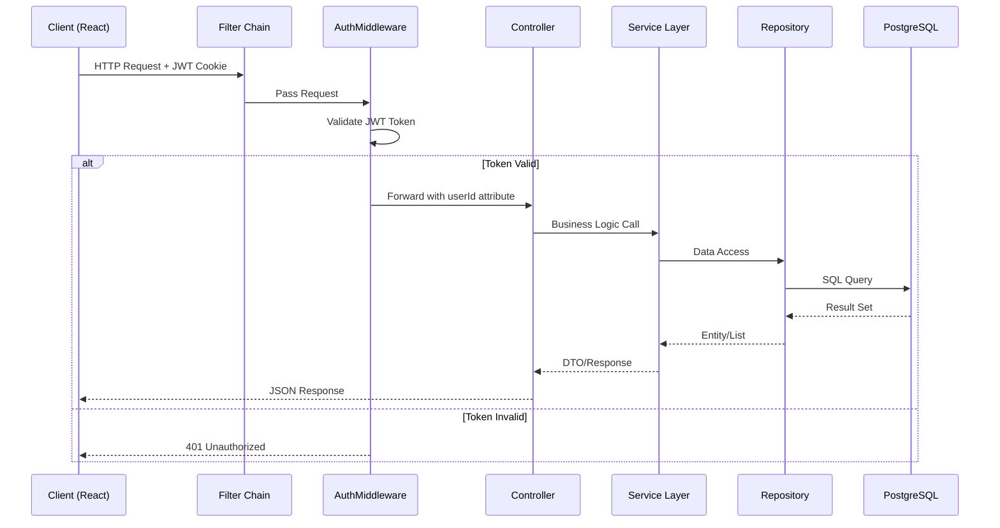

---

## Real-time Communication with WebSockets

Queue Up uses native WebSocket connections instead of HTTP polling for all real-time features. This includes instant messaging, typing indicators, online status tracking, and match notifications.

When a user logs in, the frontend opens a WebSocket connection to `/ws?userId=X`. The backend maintains a `ConcurrentHashMap` that maps user IDs to their active WebSocket sessions. This allows the server to push messages to specific users or broadcast to everyone.

### How the WebSocket Layer is Structured

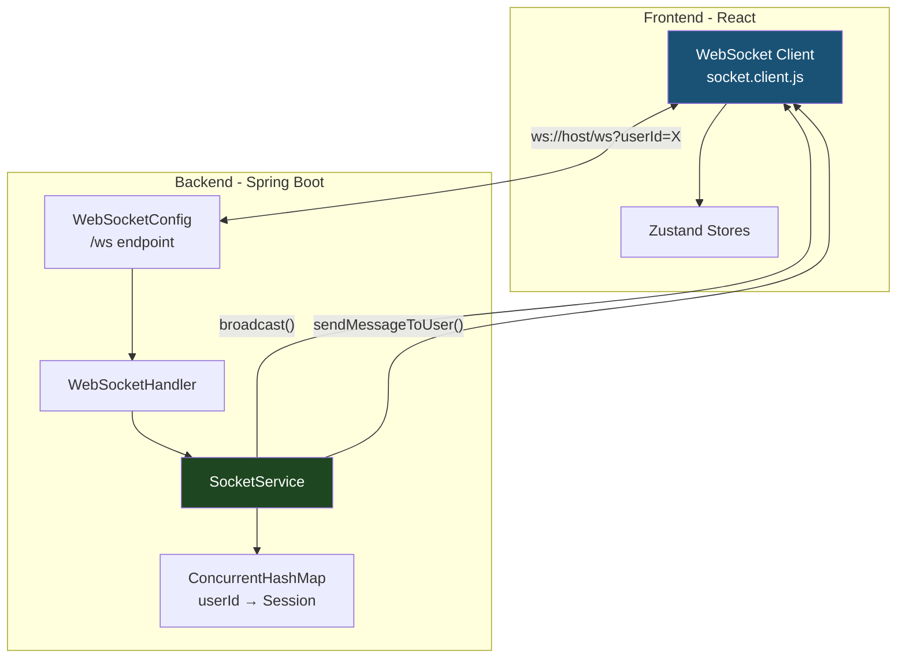

The `SocketService` class is the central hub for all WebSocket operations. It exposes two main methods: `sendMessageToUser()` for targeted messages and `broadcast()` for sending to all connected clients. Every message follows a consistent JSON format with a `type` field indicating the event name and a `payload` field containing the data.

### Events Sent Over WebSocket

| Event            | Direction                    | What it does                                                           |
| ---------------- | ---------------------------- | ---------------------------------------------------------------------- |
| `getOnlineUsers` | Server to Client             | Sends the list of all currently online user IDs when you first connect |
| `userOnline`     | Server to All                | Tells everyone that a new user just connected                          |
| `userOffline`    | Server to All                | Tells everyone that a user disconnected                                |
| `newMatch`       | Server to Both Users         | Notifies both users when they mutually like each other                 |
| `newMessage`     | Server to Receiver           | Delivers a chat message to the recipient                               |
| `typing`         | Client to Server to Receiver | Relays typing status to the conversation partner                       |
| `newUserProfile` | Server to All                | Notifies everyone when a new user registers                            |

### Connection Lifecycle

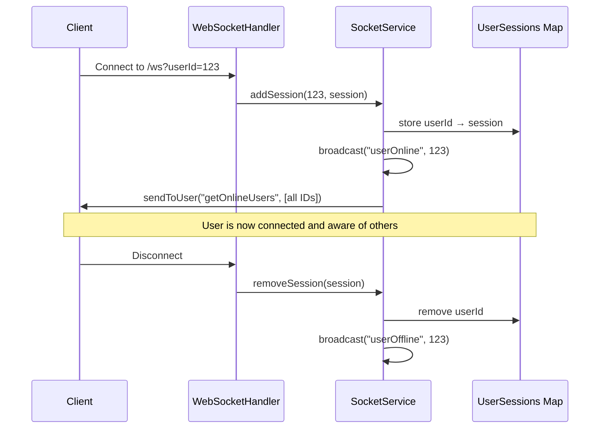

On the frontend, the WebSocket client in `socket.client.js` provides an API that mimics Socket.IO, with `on()` and `off()` methods for subscribing to events. This made it easy to structure the code in a familiar way without adding Socket.IO as a dependency. The client also handles automatic reconnection if the connection drops unexpectedly.

---

## JWT Authentication System

Queue Up uses JSON Web Tokens for authentication instead of server-side sessions. This means the server does not need to store any session state, which simplifies horizontal scaling and deployment.

### How Login and Signup Work

When a user signs up or logs in, the `AuthController` validates their credentials and then calls `JwtUtils.generateToken()` to create a signed token. This token contains the user's ID as the subject, along with the issue time and expiration time. The token is signed using HMAC-SHA256 with a secret key stored in the environment variables.

The token is not sent back in the response body. Instead, it is set as an HTTP-only cookie. This prevents JavaScript from accessing the token, which protects against XSS attacks. The cookie is automatically included in all subsequent requests to the same domain.

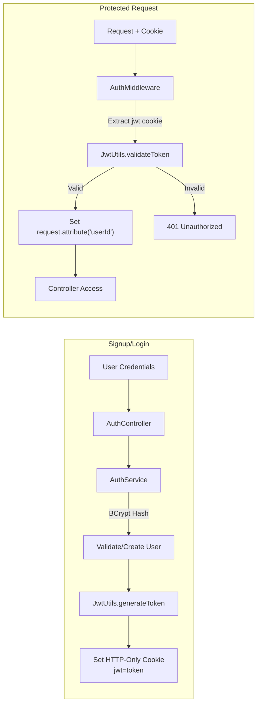

### The Token Itself

```java
// Token Generation (JwtUtils.java)
Jwts.builder()
    .setSubject(String.valueOf(userId))  // User ID as subject
    .setIssuedAt(new Date())             // Issued timestamp
    .setExpiration(new Date(now + 7_DAYS)) // 7-day expiration
    .signWith(key, SignatureAlgorithm.HS256)
    .compact();
```

The token expires after 7 days. When it expires, the user will need to log in again. There is no refresh token mechanism in the current implementation.

### Protecting Routes with AuthMiddleware

The `AuthMiddleware` class is a servlet filter that runs before every request. It checks if the request path starts with `/api` and whether it is a public route like `/api/auth/login` or `/api/auth/signup`. If it is a protected route, the middleware extracts the `jwt` cookie, validates the token, and attaches the user ID to the request attributes. Controllers can then access this user ID through `request.getAttribute("userId")`.

If the token is missing, expired, or invalid, the middleware returns a 401 Unauthorized response and the request never reaches the controller.

### Cookie Settings by Environment

The cookie settings differ between development and production to handle different security requirements:

| Environment | Secure | SameSite | HttpOnly |
| ----------- | ------ | -------- | -------- |
| Production  | true   | None     | true     |
| Development | false  | Lax      | true     |

In production, the `Secure` flag ensures the cookie is only sent over HTTPS. The `SameSite=None` setting is required because the frontend and backend may be on different subdomains depending on the deployment setup.

---

## Spotify Integration

Connecting your Spotify account is required to use Queue Up. The application uses the Spotify Web API to fetch your listening data, which forms the basis of the compatibility scoring system.

### The OAuth 2.0 Authorization Flow

Spotify uses OAuth 2.0 for third-party access. When you click "Connect Spotify" during signup, the frontend requests an authorization URL from the backend. The backend generates this URL with the required scopes and a random state token for security.

The frontend opens this URL in a popup window. You log into Spotify and authorize the application to access your listening data. Spotify then redirects the popup to our callback endpoint with an authorization code. The backend exchanges this code for access and refresh tokens by making a server-to-server request to Spotify. Finally, the tokens are sent back to the frontend via `window.postMessage()`, and the popup closes.

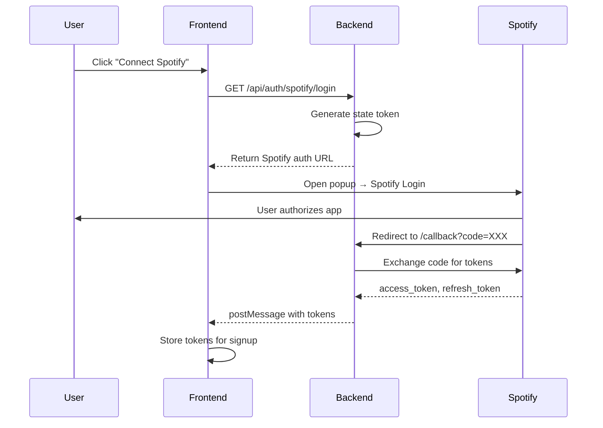

### What Data Gets Fetched

After signup, the backend uses the access token to call several Spotify API endpoints:

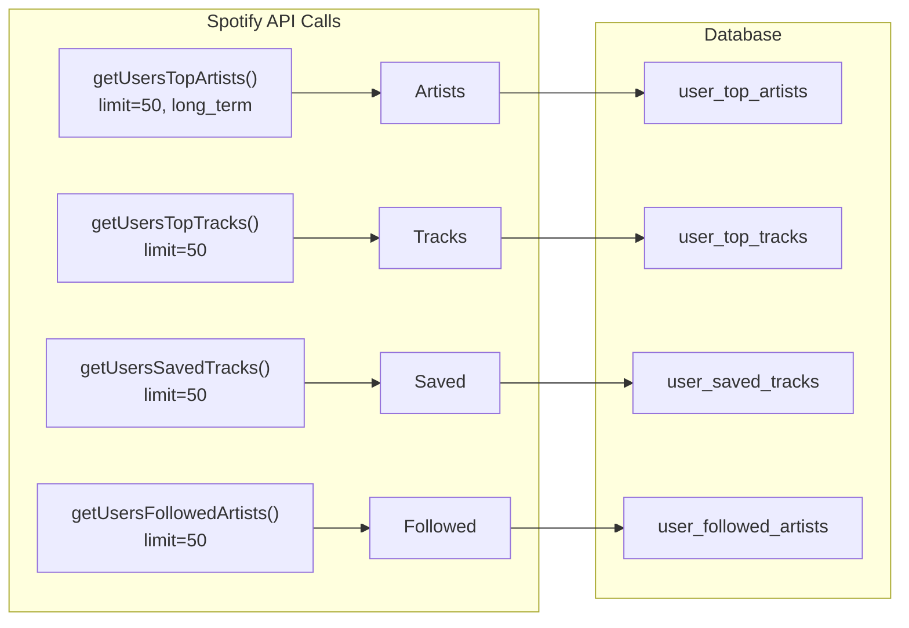

The `long_term` time range for top artists and tracks means it pulls data from roughly the last several years, not just recent listening. This gives a more stable picture of someone's music taste rather than whatever they happened to listen to last week.

Each artist and track is stored in its own table with the Spotify ID as the primary key. This prevents duplicates when multiple users share the same artist or track. Junction tables link users to their artists and tracks.

### Required OAuth Scopes

The following scopes are requested during authorization:

```
user-read-private
user-read-email
user-top-read
user-library-read
user-follow-read
```

These scopes grant read-only access. The application cannot modify your Spotify library, playlists, or account settings.

---

## Matching and Scoring Algorithm

When you swipe through potential connections, the application calculates a compatibility score based on overlapping music taste. The score is not just a count of shared artists. Different types of overlap are weighted differently to reflect their significance.

### How Scores Are Calculated

The scoring formula looks at four types of overlap:

```java
int score = (commonArtists.size() * 3) +
            (commonTracks.size() * 2) +
            commonSaved +
            commonFollowed;
```

A shared top artist is worth 3 points. This carries the most weight because top artists represent who you listen to consistently over time. A shared top track is worth 2 points. This is meaningful but slightly less significant because track preferences can be more fleeting. Shared saved tracks and followed artists are each worth 1 point. These indicate some level of interest but might not reflect your core listening habits.

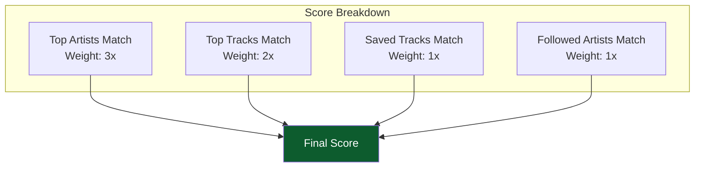

### Building the Profile Queue

When you load the home page, the `MatchService` queries for all users and then filters out anyone you have already interacted with. This includes users you swiped left on, users you swiped right on, users you have already matched with, and yourself. The remaining profiles go through the scoring algorithm.

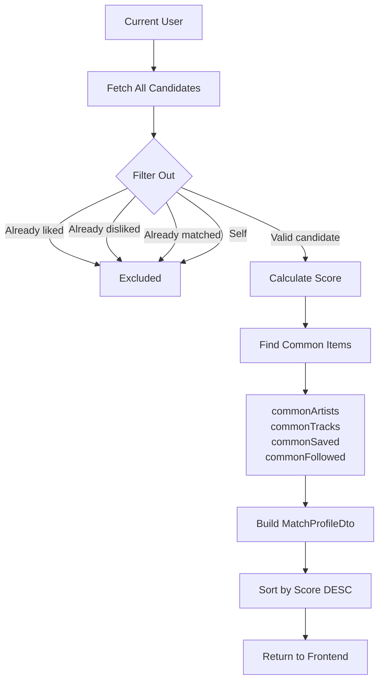

For each candidate, the service finds the intersection of your music data with theirs. It collects the shared artists, shared tracks, shared saved tracks, and shared followed artists. These are not just counted; they are returned to the frontend so the profile card can display which specific artists or tracks you have in common.

The profiles are sorted by score in descending order, so you see the most compatible people first. The frontend receives a list of `MatchProfileDto` objects containing the user's info, their music data, the calculated score, and a match percentage.

### Swipe Flow and Match Creation

When you swipe right on someone, the application creates a `UserSwipe` record with `liked = true`. Before saving, it checks whether the other person has already swiped right on you.

If they have, you now have a mutual match. Both users get added to each other's `matches` list in the database. The WebSocket layer then pushes a `newMatch` event to both users, so anyone who is online sees the match immediately without refreshing.

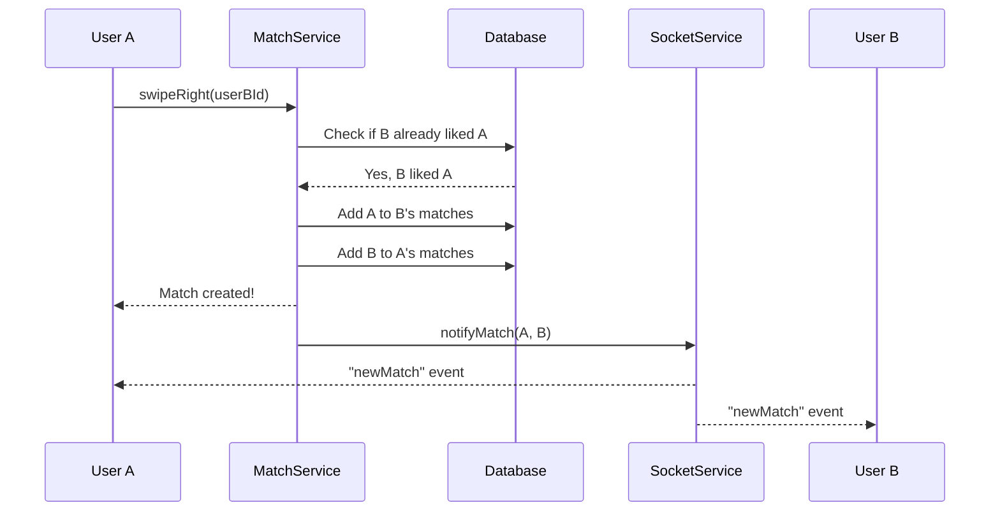

If the other person has not swiped on you yet, your like is simply recorded and you move on to the next profile. They will see the match notification when they eventually swipe right on you.

---

## Service Layer Architecture

The backend follows a layered architecture pattern where each layer has a distinct responsibility. Controllers handle HTTP requests and responses. Services contain the business logic. Repositories handle database operations. This separation makes the code easier to test, maintain, and extend.

### How Requests Flow Through the Layers

When a request comes in, it first passes through the `AuthMiddleware` for authentication. If authorized, the request reaches a controller method. The controller validates input, calls the appropriate service method, and formats the response. The service contains the actual business logic and orchestrates calls to repositories and external APIs. Repositories use Spring Data JPA to interact with the PostgreSQL database.

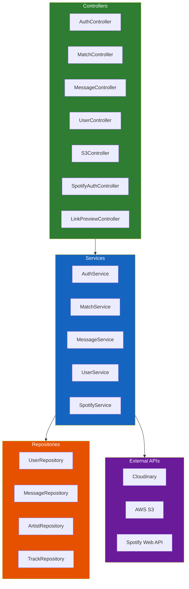

### What Each Service Does

The `AuthService` handles user registration and login. During registration, it hashes the password with BCrypt, saves the user to the database, and then calls the Spotify API to fetch the user's music data. This is the only time Spotify data is fetched; it happens once at signup.

The `MatchService` is responsible for the swiping and matching logic. It calculates compatibility scores, handles swipe actions, detects mutual likes, and returns sorted profile queues. When a mutual match happens, it also triggers WebSocket notifications through the `SocketService`.

The `MessageService` handles chat functionality. It saves messages to the database, retrieves conversation history between two users, and coordinates with the `SocketService` to deliver messages in real time. It also handles attachment metadata, though the actual files are uploaded directly to S3.

The `UserService` manages profile updates. When a user changes their name, age, or bio, this service handles the update. It also coordinates with Cloudinary for profile picture uploads.

The `SpotifyService` handles Spotify OAuth. It generates authorization URLs with the required scopes and exchanges authorization codes for access tokens. The actual music data fetching happens in `AuthService` using these tokens.

---

## Persistence Layer

The application uses Spring Data JPA with Hibernate as the ORM layer. PostgreSQL is the database. Hibernate handles schema generation and updates automatically based on the entity definitions.

### Database Schema

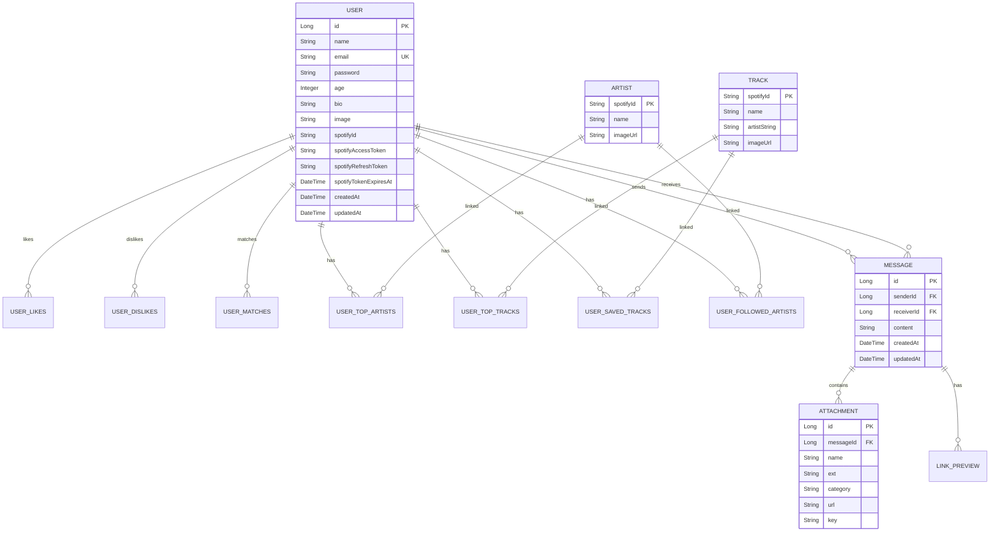

### How Music Data is Stored

Artists and tracks are stored in separate tables with the Spotify ID as the primary key. This design prevents duplicates. If two users both have Drake as a top artist, there is only one Drake row in the `artists` table. Junction tables link users to their artists and tracks.

The four junction tables are `user_top_artists`, `user_top_tracks`, `user_saved_tracks`, and `user_followed_artists`. Each row contains a user ID and an artist or track ID, representing the many-to-many relationship between users and their music data.

This design makes compatibility calculations efficient. Finding common artists between two users is a simple intersection query on the junction tables.

### Repository Patterns

The application uses Spring Data JPA repositories, which generate query implementations automatically based on method names. Custom queries use JPQL for more complex operations.

```java
// UserRepository examples
Optional<User> findByEmail(String email);
List<User> findByIdNotIn(List<Long> excludedIds);

// MessageRepository - Finding conversation history
@Query("SELECT m FROM Message m WHERE " +
       "(m.sender.id = :userId1 AND m.receiver.id = :userId2) OR " +
       "(m.sender.id = :userId2 AND m.receiver.id = :userId1) " +
       "ORDER BY m.createdAt ASC")
List<Message> findConversation(Long userId1, Long userId2);
```

The conversation query returns all messages between two users regardless of who sent which message, ordered by timestamp. This gives a complete chat history.

### Schema Management

Hibernate manages the database schema automatically. The `ddl-auto: update` setting compares the entity classes to the existing database schema and generates ALTER statements to bring them in sync. This is convenient for development but should be used carefully in production.

```yaml
spring:
  jpa:
    hibernate:
      ddl-auto: update
    properties:
      format_sql: true
    show-sql: true
```

---

## Spring Boot Configuration

The backend is built with Spring Boot 4.0.1 running on Java 21. Maven handles builds and dependency management.

### Core Dependencies

The application uses Spring Web MVC for REST APIs, Spring Data JPA for database access, Spring WebSocket for real-time communication, and Spring Security for the security filter chain. PostgreSQL is the production database. The Spotify Web API Java library handles Spotify OAuth and data fetching. Cloudinary and AWS S3 SDKs handle file storage.

```xml
<!-- Web and API -->
<dependency>spring-boot-starter-web</dependency>
<dependency>spring-boot-starter-websocket</dependency>

<!-- Data -->
<dependency>spring-boot-starter-data-jpa</dependency>
<dependency>postgresql</dependency>

<!-- Security -->
<dependency>spring-boot-starter-security</dependency>
<dependency>jjwt-api, jjwt-impl, jjwt-jackson</dependency>

<!-- External Services -->
<dependency>spotify-web-api-java</dependency>
<dependency>cloudinary-http5</dependency>
<dependency>aws-java-sdk-s3</dependency>
```

### Security Configuration

Spring Security is configured to work with JWT authentication. The security filter chain disables CSRF protection and session management since the application is stateless. All authorization checks happen in the custom `AuthMiddleware` rather than through Spring Security's built-in mechanisms.

The `AuthMiddleware` filter is added to the security chain and runs before the standard authentication filter. It extracts the JWT from cookies, validates it, and sets the user ID as a request attribute for controllers to use.

```java
@Bean
public SecurityFilterChain securityFilterChain(HttpSecurity http) {
    http
        .cors(cors -> cors.configurationSource(corsConfigurationSource()))
        .csrf(AbstractHttpConfigurer::disable)
        .sessionManagement(AbstractHttpConfigurer::disable)
        .authorizeHttpRequests(auth -> auth.anyRequest().permitAll())
        .formLogin(AbstractHttpConfigurer::disable)
        .httpBasic(AbstractHttpConfigurer::disable);

    http.addFilterBefore(new AuthMiddleware(jwtUtils),
                         UsernamePasswordAuthenticationFilter.class);
    return http.build();
}
```

CORS is configured to allow requests from the frontend origin. In development this is `localhost:5173`. In production this is configured through environment variables to match the deployed frontend URL.

---

## React Frontend Architecture

The frontend is built with React 19 and Vite. It uses Zustand for state management, TailwindCSS with DaisyUI for styling, and React Router 7 for navigation.

### Project Structure

The `src` folder contains the main application code. Components are in `src/components`, pages are in `src/pages`, and Zustand stores are in `src/store`. The WebSocket client lives in `src/socket/socket.client.js`.

Pages correspond to routes: `HomePage` for the swipe interface, `AuthPage` for login and signup, `ProfilePage` for editing your profile, and `ChatPage` for messaging a specific match. The sidebar component handles navigation and displays your list of matches.

### State Management with Zustand

Zustand stores hold application state and expose actions to update it. Each store is focused on a specific domain.

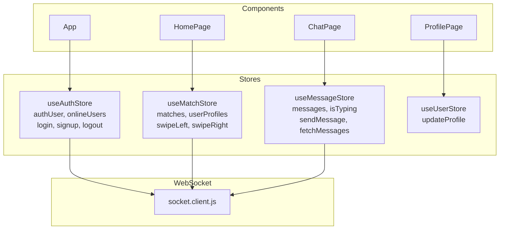

The `useAuthStore` holds the current user object and the list of online user IDs. It handles login, signup, logout, and updates the online users list when WebSocket events come in.

The `useMatchStore` holds your matches and the queue of profiles to swipe through. When you swipe right and create a match, the store updates immediately and the sidebar shows the new match.

The `useMessageStore` holds messages for the current conversation. When you open a chat, it fetches message history from the API. New messages coming in via WebSocket get appended to the list.

### Routing

```jsx
<Routes>
	<Route path="/" element={<HomePage />} />
	<Route path="/auth" element={<AuthPage />} />
	<Route path="/profile" element={<ProfilePage />} />
	<Route path="/chat/:id" element={<ChatPage />} />
	<Route path="/health" element={<HealthPage />} />
	<Route path="*" element={<ErrorPage />} />
</Routes>
```

The `:id` parameter in the chat route is the ID of the user you are chatting with. The ChatPage component fetches messages between you and that user when it mounts.

---

## Serving Static Files

Queue Up bundles the React frontend directly into the Spring Boot JAR. This results in a single deployable artifact that serves both the API and the frontend.

### How the Build Works

The Maven build process uses the `frontend-maven-plugin` to run npm commands during the build. First it installs Node and npm if they are not present. Then it runs `npm install` in the Frontend folder, followed by `npm run build`. The Vite build outputs to `/Backend/src/main/resources/static`, which gets bundled into the JAR.

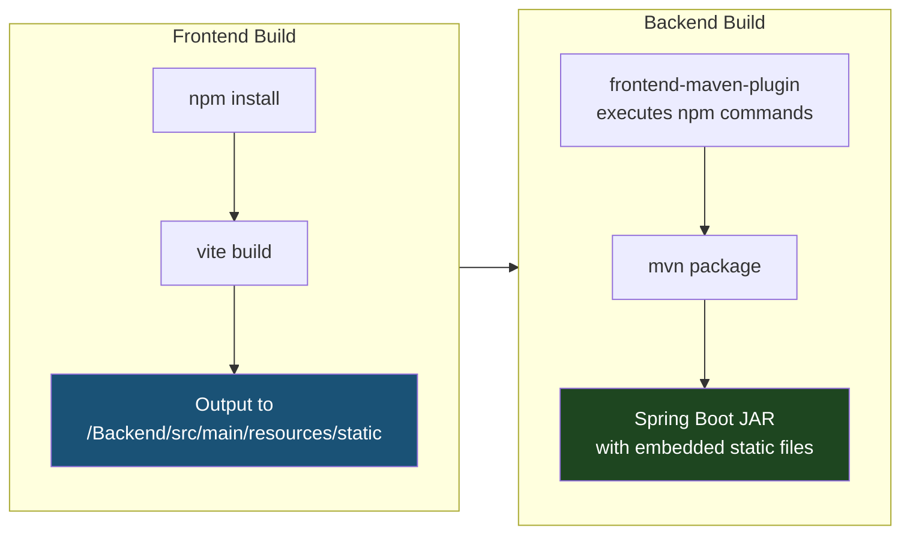

The Vite config sets the output directory to the backend's static folder:

```javascript
export default defineConfig({
	build: {
		outDir: "../Backend/src/main/resources/static",
		emptyOutDir: true,
	},
});
```

### SPA Routing with SpaWebFilter

Single-page applications need all routes to serve the same `index.html` file, letting the frontend router handle the path. The `SpaWebFilter` makes this work.

When a request comes in, the filter checks if the path starts with `/api` or `/ws`. If so, it passes through to the backend. If the path contains a dot, it is probably a static asset like JavaScript or CSS, so it also passes through. For everything else, the filter forwards the request to `index.html`.

```java
@Component
public class SpaWebFilter extends OncePerRequestFilter {
    @Override
    protected void doFilterInternal(...) {
        String path = request.getRequestURI();

        if (!path.startsWith("/api") &&
            !path.startsWith("/ws") &&
            !path.contains(".") &&
            !path.equals("/")) {
            request.getRequestDispatcher("/index.html").forward(request, response);
            return;
        }
        filterChain.doFilter(request, response);
    }
}
```

This means you can navigate directly to `/profile` or `/chat/5` and the app loads correctly. Without this filter, those routes would return a 404 because there is no `profile.html` or `chat/5.html` file.

---

## Docker Configuration

The application uses a multi-stage Docker build. The first stage compiles everything and the second stage contains only the runtime.

### Multi-stage Build

The build stage uses a Maven image with JDK 21. It copies the entire project, including both Backend and Frontend folders. When Maven runs, the frontend-maven-plugin installs Node, runs npm install, and builds the React app into the static folder. Then Maven packages everything into a Spring Boot JAR.

The runtime stage uses an Alpine-based JRE image which is much smaller than the full JDK. It copies only the JAR from the build stage. This keeps the final image size down.

```dockerfile
# Stage 1: Build
FROM maven:3.9.6-eclipse-temurin-21 AS build
WORKDIR /app
COPY . .
WORKDIR /app/Backend

ARG AWS_REGION
ARG AWS_S3_BUCKET
ENV VITE_AWS_REGION=$AWS_REGION
ENV VITE_S3_BUCKET=$AWS_S3_BUCKET

RUN mvn clean package -DskipTests

# Stage 2: Runtime
FROM eclipse-temurin:21-jre-alpine
WORKDIR /app
COPY --from=build /app/Backend/target/*.jar app.jar

EXPOSE 8080
ENTRYPOINT ["java", "-jar", "app.jar"]
```

The `ARG` and `ENV` lines pass AWS configuration to the Vite build. Vite bakes environment variables into the bundle at build time, so these values need to be available during the Docker build, not just at runtime.

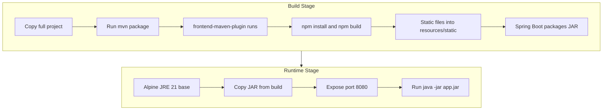

---

## Deployment

The application is deployed on Render as a Docker web service. Render pulls the repository, builds the Docker image using the Dockerfile, and runs the container.

### Environment Variables

The following environment variables need to be configured in your deployment environment:

| Variable                     | Description                               |
| ---------------------------- | ----------------------------------------- |
| `APP_CLIENT_URL`             | Frontend URL, used for CORS configuration |
| `SPRING_DATASOURCE_URL`      | PostgreSQL connection string              |
| `SPRING_DATASOURCE_USERNAME` | Database username                         |
| `SPRING_DATASOURCE_PASSWORD` | Database password                         |
| `SPOTIFY_CLIENT_ID`          | Spotify application client ID             |
| `SPOTIFY_CLIENT_SECRET`      | Spotify application secret                |
| `SPOTIFY_REDIRECT_URI`       | OAuth callback URL                        |
| `JWT_SECRET`                 | 256-bit secret for signing JWT tokens     |
| `CLOUDINARY_CLOUD_NAME`      | Cloudinary cloud name                     |
| `CLOUDINARY_API_KEY`         | Cloudinary API key                        |
| `CLOUDINARY_API_SECRET`      | Cloudinary API secret                     |
| `AWS_ACCESS_KEY_ID`          | AWS credentials for S3                    |
| `AWS_SECRET_ACCESS_KEY`      | AWS credentials                           |
| `AWS_REGION`                 | S3 bucket region                          |
| `AWS_S3_BUCKET`              | S3 bucket name                            |

---

## Getting Started

### Prerequisites

You will need the following installed on your machine:

- Java 21 or higher
- Node.js 20 or higher
- PostgreSQL 15 or higher
- Maven 3.9 or higher
- Docker if you want to build and run the containerized version

### Local Development Setup

Clone the repository:

```bash
git clone https://github.com/Shahir-47/Queue-Up.git
cd Queue-Up
```

Create a PostgreSQL database. You can do this with Docker:

```bash
docker run -d --name queueup-db \
  -e POSTGRES_DB=queueup \
  -e POSTGRES_PASSWORD=yourpassword \
  -p 5432:5432 postgres:15
```

Set up your environment variables. You can create a `.env` file in the Backend folder or export them directly:

```bash
export SPRING_DATASOURCE_URL=jdbc:postgresql://localhost:5432/queueup
export SPRING_DATASOURCE_USERNAME=postgres
export SPRING_DATASOURCE_PASSWORD=yourpassword
export JWT_SECRET=your-256-bit-secret-key-here-min-32-chars
export SPOTIFY_CLIENT_ID=your-spotify-client-id
export SPOTIFY_CLIENT_SECRET=your-spotify-client-secret
export SPOTIFY_REDIRECT_URI=http://localhost:8080/api/auth/spotify/callback
export CLOUDINARY_CLOUD_NAME=your-cloudinary-name
export CLOUDINARY_API_KEY=your-cloudinary-key
export CLOUDINARY_API_SECRET=your-cloudinary-secret
export AWS_ACCESS_KEY_ID=your-aws-key
export AWS_SECRET_ACCESS_KEY=your-aws-secret
export AWS_REGION=us-east-1
export AWS_S3_BUCKET=your-bucket-name
```

Start the backend:

```bash
cd Backend
./mvnw spring-boot:run
```

In a separate terminal, start the frontend development server:

```bash
cd Frontend
npm install
npm run dev
```

The frontend will be available at `http://localhost:5173` and will proxy API requests to the backend on port 8080.

### Production Build

To build a production JAR that includes the frontend:

```bash
cd Backend
./mvnw clean package
java -jar target/Backend-0.0.1-SNAPSHOT.jar
```

This runs the frontend-maven-plugin to build the React app, bundles it into the JAR, and starts the server. The application will be available at `http://localhost:8080`.

### Docker Build

```bash
docker build -t queue-up \
  --build-arg AWS_REGION=us-east-1 \
  --build-arg AWS_S3_BUCKET=your-bucket .

docker run -p 8080:8080 \
  -e SPRING_DATASOURCE_URL=jdbc:postgresql://host.docker.internal:5432/queueup \
  -e SPRING_DATASOURCE_USERNAME=postgres \
  -e SPRING_DATASOURCE_PASSWORD=yourpassword \
  -e JWT_SECRET=your-secret \
  queue-up
```

---

## API Reference

All endpoints except authentication routes require a valid JWT cookie.

### Authentication Endpoints

| Endpoint                     | Method | Description                             |
| ---------------------------- | ------ | --------------------------------------- |
| `/api/auth/signup`           | POST   | Register a new user with Spotify tokens |
| `/api/auth/login`            | POST   | Log in and receive JWT cookie           |
| `/api/auth/logout`           | POST   | Clear the JWT cookie                    |
| `/api/auth/me`               | GET    | Get the currently authenticated user    |
| `/api/auth/spotify/login`    | GET    | Get Spotify authorization URL           |
| `/api/auth/spotify/callback` | GET    | Handle Spotify OAuth callback           |

### Match Endpoints

| Endpoint                        | Method | Description                                 |
| ------------------------------- | ------ | ------------------------------------------- |
| `/api/matches`                  | GET    | Get all of the current user's matches       |
| `/api/matches/user-profiles`    | GET    | Get queue of swipeable profiles with scores |
| `/api/matches/swipe-right/{id}` | POST   | Like a user                                 |
| `/api/matches/swipe-left/{id}`  | POST   | Pass on a user                              |

### Message Endpoints

| Endpoint                              | Method | Description                              |
| ------------------------------------- | ------ | ---------------------------------------- |
| `/api/messages/send`                  | POST   | Send a message with optional attachments |
| `/api/messages/conversation/{userId}` | GET    | Get message history with a user          |

### User Endpoints

| Endpoint            | Method | Description                             |
| ------------------- | ------ | --------------------------------------- |
| `/api/users/update` | PUT    | Update profile name, age, bio, or image |

### Utility Endpoints

| Endpoint                           | Method | Description                                            |
| ---------------------------------- | ------ | ------------------------------------------------------ |
| `/api/uploads/s3/presign`          | POST   | Get a presigned URL for uploading to S3                |
| `/api/uploads/s3/presign-download` | POST   | Get a presigned URL for downloading from S3            |
| `/api/link-preview`                | POST   | Fetch metadata for a URL to show a link preview        |
| `/api/health`                      | GET    | Health check endpoint, does not require authentication |

---

## Try It Out

The application is live and available at **[queue-up.onrender.com](https://queue-up.onrender.com)**. You will need a Spotify account to sign up.

---

## License

This project is open source and available under the MIT License.

---

## Acknowledgments

This project uses the Spotify Web API for music data, Cloudinary for image storage, AWS S3 for file attachments, and is deployed on Render.

---

Built by [Shahir Ahmed](https://github.com/Shahir-47)
